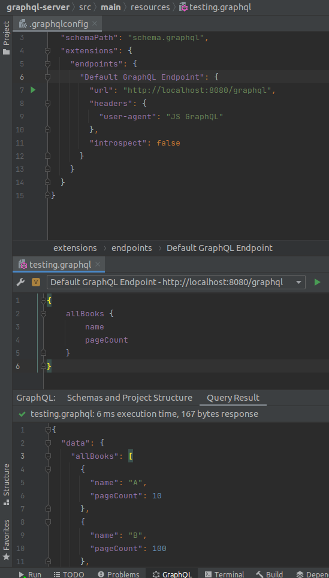

# About
This project is a sample backend application using GraphQL. Graphql implementation for Java is [available on
GitHub](https://github.com/graphql-java-kickstart/graphql-spring-boot). Please be aware that sometimes I might 
make a mistake in the word `GraphQL` and `GraphiQL` respectively, such as `GrahpQL`, `GrapihQL` or similar. 
Use expected words in case you find this kind of error (unless specifically guided otherwise).

# GraphQL & GraphQL Playground
Running this example spins up a GraphQL server on `localhost:8080/graphql`. Available through 
the `com.graphql-java-kickstart` dependency there is a GraphQL playground ready at `http://localhost:8080/graphiql` 
(notice the letter 'i', it is not graphql but graph-i-ql). This lets us use the browser interface to test
our endpoints. 

## From the IDE
There is also another notable mention - IntelliJ IDEA GraphQL extension. After creating GraphQL configuration path 
in our `/resources/` path, we can use this extension to perform queries from within the IDE !

Example configuration file:

```json
{
  "name": "Starting GraphQL Schema",
  "schemaPath": "schema.graphql",
  "extensions": {
    "endpoints": {
      "Default GraphQL Endpoint": {
        "url": "http://localhost:8080/graphql",
        "headers": {
          "user-agent": "JS GraphQL"
        },
        "introspect": false
      }
    }
  }
}
```

After that we can open a graphql file e.g. `testing.graphql` and write our query:

```graphql
{
    allBooks {
        name
        pageCount
    }
}
```

After opening the file we should see a combo box on top of the file with already filled out values. This is
obtained from the configuration file we just created. After pressing the play button on the right, we see the
results down in the terminal `Query Results` tab. Neat !

Not only we get environment to test our queries, but also autocompletion out of the box !!! See the result in the
image below:



# Instantiating GraphQL
There are multiple available implementations of GraphQL within Java. There are several possibilities on 
how to set up the GraphQL configuration.

### Manual Configuration
As explained on the [tutorial page](https://www.graphql-java.com/tutorials/getting-started-with-spring-boot#book-datafetcher),
creating a GraphQL instance consists of ~3 steps:
1. Loading and parsing the schema.
   1. Creating types.
   2. Creating queries and mutations.
2. Wiring up GraphQL with Java.
   1. Setting up relations between GraphQL types and POJOs.
   2. Attaching resolvers to GraphQL queries/mutations.
3. Creating GraphQL instance by providing it with our manual configuration.

Perfectly summed up in the following image:


Explanation:
- TypeDefinitionRegistry parses schema file.
  - `TypeDefinitionRegistry typeRegistry = new SchemaParser().parse(sdl);`
- Runtime Wiring is responsible for wiring the GraphQL actions to Java methods.
  - ```java
    RuntimeWiring.newRuntimeWiring()
    // associated with type 'Query'
    .type(newTypeWiring("Query")
    // bookByID gets data via this method
    .dataFetcher("bookById", graphQLDataFetchers.getBookByIdDataFetcher()))
    ```
- GraphQLSchema mixes these two definitions together to create a 'black box' for the GraphQL to use
  - ```java
    private GraphQLSchema buildSchema(String sdl) {
        TypeDefinitionRegistry typeRegistry = new SchemaParser().parse(sdl);
        RuntimeWiring runtimeWiring = buildWiring();
        SchemaGenerator schemaGenerator = new SchemaGenerator();
        return schemaGenerator.makeExecutableSchema(typeRegistry, runtimeWiring);
    }
    ```
- Finally, we can create the GraphQL instance itself:
  - `return GraphQL.newGraphQL(graphQLSchema).build();`

### Automagic configuration
There are tools that allow us to just use them as dependencies and this 'boilerplate' code from manual 
configuration does no longer need to be our problem. These tools are called 'kickstarters' and are available
in maven repository.

This project uses following: 
```groovy
// playground
implementation group: 'com.graphql-java-kickstart', name: 'graphiql-spring-boot-starter', version: '11.1.0'
// graphql java implementation
implementation group: 'com.graphql-java-kickstart', name: 'graphql-java-tools', version: '12.0.2'
// spring-boot integration
implementation group: 'com.graphql-java-kickstart', name: 'graphql-spring-boot-starter', version: '12.0.0'
```

This configuration alone allows us to forget about the manual definitions and create resolvers and POJOs 
and run without problems. In case this project changed or evolved, refer to git tag 'v.1.0-initial' on the
main branch to see how little is required to run and example.

# Naming convention and configuration
Inspecting the code from GraphQL for Java on GitHub I decided to store some important notes.

## Graphql Schema
It is expected that the schema is located anywhere but ends with a `.graphqls` extension. Its location and structure is
configurable via the `schemaLocationPattern` property.

Default: `private String schemaLocationPattern = "**/*.graphqls";`

## Graphql Server Location
Can be changed in `application.properties` via `graphql.servlet.mapping=/your-endpoint`. Note that changing this
location can affect other tools such as GraphiQL which expects schema to be at `/graphql`.

# Common Issues

## GraphQL Server not available
There is no GraphQL endpoint at `/graphql`. This can be caused by number of issues and one of them might be 
missing query handlers. If there are no handler I suspect that the server doesn't even start. But be aware, 
that creating a handler implementing GraphQLResolver interface isn't enough - it has to be picked up by Spring,
so it is necessary to annotate it with `@Component` (or any other suitable annotation):

```java

@Component  // <- Important !
public class MyResolver implements GraphQLQueryResolver {
    ...
}
```

## Complex Net of Dependencies
If you are confused about what dependency has to be available and what is already used, you can take a look
at Gradle. In IntelliJ in the Gradle tab there is a list of dependencies (runtime, implementation, etc.) and
there is a little star next to the dependency if it was already included.

```groovy
com.graphql-java:graphql-java:18.1 (*)  // This dependency is omitted because it is already imported
```

You can safely remove these starred dependencies or can adjust the dependencies which import your starred
ones.

Dependencies at the start of the project, which worked as expected, were:

- graphql-spring-boot-starter (graphql-kickstart project)
- spring-boot-starter-web
- lombok (optional)

## Schema is not properly loaded / types not found
Sometimes it can happen that even though the schema is defined and types are available, running
the server results in a crash with a message that:

- Root Query types couldn't be found
- Type X couldn't be found
- ...

Other problem might be that server started but documentation shows only a part of schema available
(for example we only have root query type and don't see queries of types that extend it):

```graphql
# schema.graphqls
type Query {
    rootQuery: RootResult # no problem, visible and callable from playground
}

# myType.graphql
extends type Query {
    customQuery: SomeResult # not visible, as if it wasn't loaded
}
```

These errors are easily resolvable when you merge split graphql files into
one single file, but that is not a feasible solution.

I discovered that naming and **file extension matters**. While for some reason
having files named `.graphql` works in a mysterious way (sometimes yes, sometimes no),
naming them `.graphqls` is the safer option. 

I suspect that root schema definitions **must** be in a `.graphqls` file. Providing the schema 
with new types may be in a regular `.graphql` files and is fetched by the graphql-tools. 
Nevertheless, I would always recommend to always extend files with `.graphqls`.