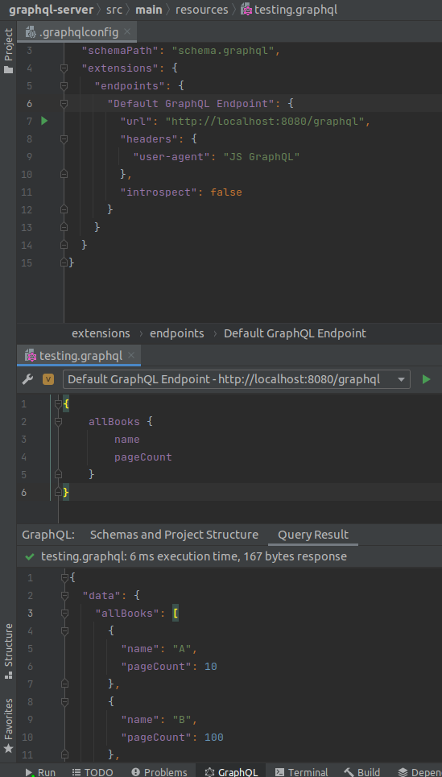

# About
This project is a sample backend application using GraphQL. Graphql implementation for Java is [available on
GitHub](https://github.com/graphql-java-kickstart/graphql-spring-boot). Please be aware that sometimes I might 
make a mistake in the word `GraphQL` and `GraphiQL` respectively, such as `GrahpQL`, `GrapihQL` or similar. 
Use expected words in case you find this kind of error (unless specifically guided otherwise).

# GraphQL & GraphQL Playground
Running this example spins up a GraphQL server on `localhost:8080/graphql`. Available through 
the `com.graphql-java-kickstart` dependency there is a GraphQL playground ready at `http://localhost:8080/graphiql` 
(notice the letter 'i', it is not graphql but graph-i-ql). This lets us use the browser interface to test
our endpoints. 

## From the IDE
There is also another notable mention - IntelliJ IDEA GraphQL extension. After creating GraphQL configuration path 
in our `/resources/` path, we can use this extension to perform queries from within the IDE !

Example configuration file:

```json
{
  "name": "Starting GraphQL Schema",
  "schemaPath": "schema.graphql",
  "extensions": {
    "endpoints": {
      "Default GraphQL Endpoint": {
        "url": "http://localhost:8080/graphql",
        "headers": {
          "user-agent": "JS GraphQL"
        },
        "introspect": false
      }
    }
  }
}
```

After that we can open a graphql file e.g. `testing.graphql` and write our query:

```graphql
{
    allBooks {
        name
        pageCount
    }
}
```

After opening the file we should see a combo box on top of the file with already filled out values. This is
obtained from the configuration file we just created. After pressing the play button on the right, we see the
results down in the terminal `Query Results` tab. Neat !

Not only we get environment to test our queries, but also autocompletion out of the box !!! See the result in the
image below:



## Request-Response example

> Request
```json
{
  "operationName":"AllFishTestQuery",
  "variables":{},
  "query":"query AllFishTestQuery {\n  allFish {\n    id\n    name\n  }\n}\n"
}
```

> Response
```json
{
  "data": {
    "allFish":[
      {"id":"1","name":"Kapor"},
      {"id":"2","name":"Štuka"}
    ]
  }
}
```

# Instantiating GraphQL
There are multiple available implementations of GraphQL within Java. There are several possibilities on 
how to set up the GraphQL configuration.

### Manual Configuration
As explained on the [tutorial page](https://www.graphql-java.com/tutorials/getting-started-with-spring-boot#book-datafetcher),
creating a GraphQL instance consists of ~3 steps:
1. Loading and parsing the schema.
   1. Creating types.
   2. Creating queries and mutations.
2. Wiring up GraphQL with Java.
   1. Setting up relations between GraphQL types and POJOs.
   2. Attaching resolvers to GraphQL queries/mutations.
3. Creating GraphQL instance by providing it with our manual configuration.

Perfectly summed up in the following image:


Explanation:
- TypeDefinitionRegistry parses schema file.
  - `TypeDefinitionRegistry typeRegistry = new SchemaParser().parse(sdl);`
- Runtime Wiring is responsible for wiring the GraphQL actions to Java methods.
  - ```java
    RuntimeWiring.newRuntimeWiring()
    // associated with type 'Query'
    .type(newTypeWiring("Query")
    // bookByID gets data via this method
    .dataFetcher("bookById", graphQLDataFetchers.getBookByIdDataFetcher()))
    ```
- GraphQLSchema mixes these two definitions together to create a 'black box' for the GraphQL to use
  - ```java
    private GraphQLSchema buildSchema(String sdl) {
        TypeDefinitionRegistry typeRegistry = new SchemaParser().parse(sdl);
        RuntimeWiring runtimeWiring = buildWiring();
        SchemaGenerator schemaGenerator = new SchemaGenerator();
        return schemaGenerator.makeExecutableSchema(typeRegistry, runtimeWiring);
    }
    ```
- Finally, we can create the GraphQL instance itself:
  - `return GraphQL.newGraphQL(graphQLSchema).build();`

### Automagic configuration
There are tools that allow us to just use them as dependencies and this 'boilerplate' code from manual 
configuration does no longer need to be our problem. These tools are called 'kickstarters' and are available
in maven repository.

This project uses following: 
```groovy
// playground
implementation group: 'com.graphql-java-kickstart', name: 'graphiql-spring-boot-starter', version: '11.1.0'
// graphql java implementation
implementation group: 'com.graphql-java-kickstart', name: 'graphql-java-tools', version: '12.0.2'
// spring-boot integration
implementation group: 'com.graphql-java-kickstart', name: 'graphql-spring-boot-starter', version: '12.0.0'
```

This configuration alone allows us to forget about the manual definitions and create resolvers and POJOs 
and run without problems. In case this project changed or evolved, refer to git tag 'v.1.0-initial' on the
main branch to see how little is required to run and example.

# Naming convention and configuration
Inspecting the code from GraphQL for Java on GitHub I decided to store some important notes.

## Graphql Schema
It is expected that the schema is located anywhere but ends with a `.graphqls` extension. Its location and structure is
configurable via the `schemaLocationPattern` property.

Default: `private String schemaLocationPattern = "**/*.graphqls";`

## Graphql Server Location
Can be changed in `application.properties` via `graphql.servlet.mapping=/your-endpoint`. Note that changing this
location can affect other tools such as GraphiQL which expects schema to be at `/graphql`.

# Testing
For testing, we will use JUnit 5 with Spring's already bundled packages like Mockito.

## Parameterized Tests
One of the new features that was introduced in JUnit 5 is the support of 
[parameterized tests](https://junit.org/junit5/docs/current/user-guide/#writing-tests-parameterized-tests). These tests are 
just regular tests with the option to enable parameters that will be supplied to the test method when executing. See 
the example below for a clear implementation sample:

```java
@ParameterizedTest
@ValueSource(ints = {1, 3, 5, -3, 15, Integer.MAX_VALUE}) // six different values will be passed in and used as test data   
void isOdd_ShouldReturnTrueForOddNumbers(int number) {
    assertTrue(Numbers.isOdd(number));
}
```

There are many options on how to obtain values for our parametrized test. One way, suitable for more complex data, can 
be a method denoted by the `@MethodSource` annotation. The supplier is a static method (unless the class lifecycle is 
`@TestInstance(Lifecycle.PER_CLASS)`) which returns a stream of arguments. It should not obtain any parameters. 
Parametrized method that gets values from a supplier can either use the annotation in it's "pure" form or provide it
with the name of the supplier method `@MethodSource("getSampleProducts")`.

```java
@SpringBootTest
class AttendanceResolverTest {
    
    @ParameterizedTest
    @MethodSource("stringArgs")
    void testStrings(String arg, int num) {
        // ...repeated for every argument
    }
    
    private static Arguments<String> getArgs() {
        return Stream.of(
                Arguments.of("sample", 0),
                Arguments.of("other sample", 5),
                Arguments.of("121323121412", -1),
                Arguments.of("    ", 0),
                Arguments.of("?", 12)
        )
    }    
}
```

## Base Setup
For a typical test we need a Spring configuration. This is achieved via 2 annotations:
- `@SpringBootTest`: Initializes application context as if we're running in a common Spring environment.
- `@ExtendWith(SpringExtension.class)`: Makes Spring aware of JUnit lifecycle notifications. This annotation is already
included in the `@SpringBootTest` annotation.
- `@AutoConfigureMockMvc`: Creates an environment for MVC applications with full support of request/response 
interactions via a mock server instead of a real one. 
- `@Import(TestConfig.class)`: Custom class configuring beans created specifically for testing. Used only if required.

A test class should then look something like this:

```java
@SpringBootTest
@AutoConfigureMockMvc
@Import(TestConfig.class)
public class SomeTest {
    
}
```

Note that tutorials online suggest using `@ExtendWith(SpringExtension.class)` but if we take a look at `@SpringBootTest` 
we can see that this annotation is already included. Furthermore, there is another essential configuration when using 
JUnit specifically: `@SpringJUnitConfig(TestConfig.class)` and `@SpringJUnitWebConfig(TestConfig.class)`.

### Mocking
Mocking a request/response is necessary for web environment tests. We do this by creating a request with a predefined 
return value(s) with the help of [MockMvc](https://docs.spring.io/spring-framework/docs/current/reference/html/testing.html#spring-mvc-test-framework).
Steps to mock a request and validate the response now consists usually of:

1. Mock service that is being tested, usually with the help of `@MockBean` Mockito annotation.
2. In the test, Mock a sample response (list of objects, objects, numbers, ...) to a specific action.
3. Trigger the action (get, post or other HTTP methods) with the help of `MockMvc` and expect results.
4. Make assertions of response.

## How to test GraphQL ?
With GraphQL we don't need to manually wire every request. GraphQL exposes a single endpoint: `/graphql`. All the queries, 
mutations and other interactions with the GraphQL server are supplied as body of a POST request to this endpoint. An 
example of a request can be seen below. Notice that text formatting is also preserved (new line characters are sent to the server):

```json
{
  "operationName":"AllFishStatistics",
  "variables":{},
  "query":"query AllFishStatistics {\n  allFishStatistics {\n    fish {\n      id\n      name\n    }\n    totalWeight\n    totalAmount\n  }\n}\n"
}
```

There are a few consequences of this behaviour:
- Typical Spring application doesn't implement any controllers. Body of a request is handled by libraries. Therefore, we
  cannot test specific endpoints like in a traditional REST application (i.e. `/cats` or `cat/{id}`).
- We need to create GraphQL tests with specific request fields and create sensible defaults if necessary.

Since all requests are of HTTP POST and usually point towards the same endpoint, we can utilize an existing 
`graphql-spring-boot-starter-test` dependency from `graphql-java-kickstart`.
Using this library provides us with neat test annotations like `@GraphQLTest` or utility tools that wrap our requests
as described above and return a response back (done by `GraphQLTestTemplate`). It appears that the GraphQL server has
undefined initial state.

Minimalistic approach to the test configuration can be as follows:

```java
import static org.mockito.Mockito.doReturn;
import static org.skyscreamer.jsonassert.JSONAssert.assertEquals;
// ...

@SpringBootTest(webEnvironment = SpringBootTest.WebEnvironment.RANDOM_PORT)
public class SomeGraphQLTest {

    @MockBean
    SomeResolver resolver;

    @Autowired
    GraphQLTestTemplate graphQLTestTemplate;

    @Test
    void test() {
        String nameMock = "sample-test-name";
        doReturn(nameMock).when(resolver).getUserName();
        // load a text file with the request just like when
        // issuing it from the client and fire a POST request
        GraphQLResponse response = graphQLTestTemplate.postForResource("graphql/sampleRequest.graphql");
        
        assertTrue(response.isOk());
        // ...
    }
}
```

```graphql
# graphql/sampleRequest.graphql
query SampleQuery {
    getUser {
        name
    }
}
```

### Asserting data
Using `MockMvc` we can `perform` a request and immediately assert it using `andExpect` and other assertions. These methods
are not available when using the `GraphQLTestTemplate` object. We can use several `get...()` methods supplied by the 
returned response of `GraphQLResponse` type. These methods expect us to declare "path" to the JSON Object, JSON array, etc. 
that should be accessible on the response object. Usage is simple:

```java
GraphQLResponse response = graphQLTestTemplate.postForResource("graphql/requests/allFish.graphql");
List<Fish> list = response.getList("data.allFish", Fish.class);
```

Other available assertions are supported directly via the `GraphQLTestTemplate` and start with `assertThat...()`. These 
use the [JSONPath syntax](https://support.smartbear.com/alertsite/docs/monitors/api/endpoint/jsonpath.html#notation).
Through these methods we can access any property from the response and assert it directly. Notice that assertion methods
offer basic conversion between GraphQL types and let us use these value to further asses the response.

```java
GraphQLResponse response = graphQLTestTemplate.postForResource("graphql/requests/allFish.graphql");
response.assertThatField("$.data").isNotNull();
response.assertThatField("$.*.allFish").isNotNull();
response.assertThatField("$.data.fish.id").asInteger().isEqualTo(1);
response.assertThatField("$.data.id").as(Long.class).isEqualTo(attendanceId);       // convert to Java Type if necessary

```

### Mocking requests
Mocking is easily done with `GraphQLTestTemplate` as already mentioned. It provides way of automatically loading 
request file from string path and offers more detailed `perform` operation in case we need to use variables for mutations.
This can be tricky if we have nested variables and arrays, but it only requires some Jackson serialization magic to work.

Serializing variables is simple. For starters, we need to create an `ObjectNode` via the `ObjectMapper`. After that
we just `put` variables into it:

```java
ObjectNode variables = mapper.createObjectNode();
variables.put("id", mockFish.getId());
variables.put("amount", totalAmount);

// array of objects as input
ArrayNode newCatchesVariable = mapper.valueToTree(newCatches);
variables.putArray("catches").addAll(newCatchesVariable);
        
// note that THIS WILL NOT work - call to `addAll()` is ambiguous ! ! !
//variables.putArray("catches").addAll(mapper.valueToTree(newCatchesList));

var response = graphQLTestTemplate.perform("graphql/mutations/someChange.graphql", variables);
// ...
```

# Common Issues

## GraphQL Server not available
There is no GraphQL endpoint at `/graphql`. This can be caused by number of issues and one of them might be
missing query handlers. If there are no handler I suspect that the server doesn't even start. But be aware,
that creating a handler implementing GraphQLResolver interface isn't enough - it has to be picked up by Spring,
so it is necessary to annotate it with `@Component` (or any other suitable annotation):

```java

@Component  // <- Important !
public class MyResolver implements GraphQLQueryResolver {
    ...
}
```

## Complex Net of Dependencies
If you are confused about what dependency has to be available and what is already used, you can take a look
at Gradle. In IntelliJ in the Gradle tab there is a list of dependencies (runtime, implementation, etc.) and
there is a little star next to the dependency if it was already included.

```groovy
com.graphql-java:graphql-java:18.1 (*)  // This dependency is omitted because it is already imported
```

You can safely remove these starred dependencies or can adjust the dependencies which import your starred
ones.

Dependencies at the start of the project, which worked as expected, were:

- graphql-spring-boot-starter (graphql-kickstart project)
- spring-boot-starter-web
- lombok (optional)

## Schema is not properly loaded / types not found
Sometimes it can happen that even though the schema is defined and types are available, running
the server results in a crash with a message that:

- Root Query types couldn't be found
- Type X couldn't be found
- ...

Other problem might be that server started but documentation shows only a part of schema available
(for example we only have root query type and don't see queries of types that extend it):

```graphql
# schema.graphqls
type Query {
    rootQuery: RootResult # no problem, visible and callable from playground
}

# myType.graphql
extends type Query {
    customQuery: SomeResult # not visible, as if it wasn't loaded
}
```

These errors are easily resolvable when you merge split graphql files into
one single file, but that is not a feasible solution.

I discovered that naming and **file extension matters**. While for some reason
having files named `.graphql` works in a mysterious way (sometimes yes, sometimes no),
naming them `.graphqls` is the safer option.

I suspect that root schema definitions **must** be in a `.graphqls` file. Providing the schema
with new types may be in a regular `.graphql` files and is fetched by the graphql-tools.
Nevertheless, I would always recommend to always extend files with `.graphqls`.

## Lombok @Builder with JPA repositories
There is an issue with JPA repositories and the @Builder annotation. Using just pure builder annotation 'hides' the
default no-args constructor and throws a silent error:
```java
@Data
@Builder
@Entity
@Table(name="fishing_ground")
public class FishingGround {
    // ...
}
```
Error/warning:
`org.hibernate.tuple.PojoInstantiator     : HHH000182: No default (no-argument) constructor for class: sk.catheaven.graphqlserver.domain.persistence.FishingGround (class must be instantiated by Interceptor)`

This would result in `NullPointerException` and has simple workaround. Defining `@NoArgsConstructor` is not enough, but
defining both `@NoArgsConstructor` and `@AllArgsConstructor` does the deal:

```java
@Data
@Builder
@NoArgsConstructor
@AllArgsConstructor
@Entity
@Table(name="fishing_ground")
public class FishingGround {
    // ... 
}
```

## Hibernate HQL Subquery with List Result
I tried to create one statistics object with the usage of one single query. It is not possible with pure SQL but it
could be possible if hibernate accounts for that. Turns out [it really isn't possible](https://stackoverflow.com/questions/12379238/hql-new-list-within-new-object)
(probably).

My last query attempt was:

```java
@Query(" SELECT new sk.catheaven.graphqlserver.domain.statistics.FishingGroundCatchStatistics( " +
        "                        fg, " +
        "                        (SELECT new sk.catheaven.graphqlserver.domain.statistics.CatchStatistics(" +
        "                                                   catch.fish, " +
        "                                                   COALESCE(SUM(catch.totalAmount), 0), " +
        "                                                   COALESCE(SUM(catch.totalWeight), 0)" +
        "                                                ) " +
        "                            FROM Catch catch " +
        "                            GROUP BY catch.attendance.fishingGround, catch.fish " +
        "                            HAVING   catch.attendance.fishingGround = fg" +
        "                        ) " +
        "           ) " +
        "        FROM FishingGround fg")
List<FishingGroundCatchStatistics> allFishingGroundCatchStatistics();
```

## `@GraphQLTest` annotation not working
Even though there is an annotation already available for GraphQL tests (namely `@GraphQLTest` as class-level element) it
[doesn't seem to work](https://github.com/graphql-java-kickstart/graphql-spring-boot/discussions/267). It should be 
configuring the `@SpringBootTest` annotation by default, but it seems that there are issues with this configuration and
some beans are therefore undefined.
